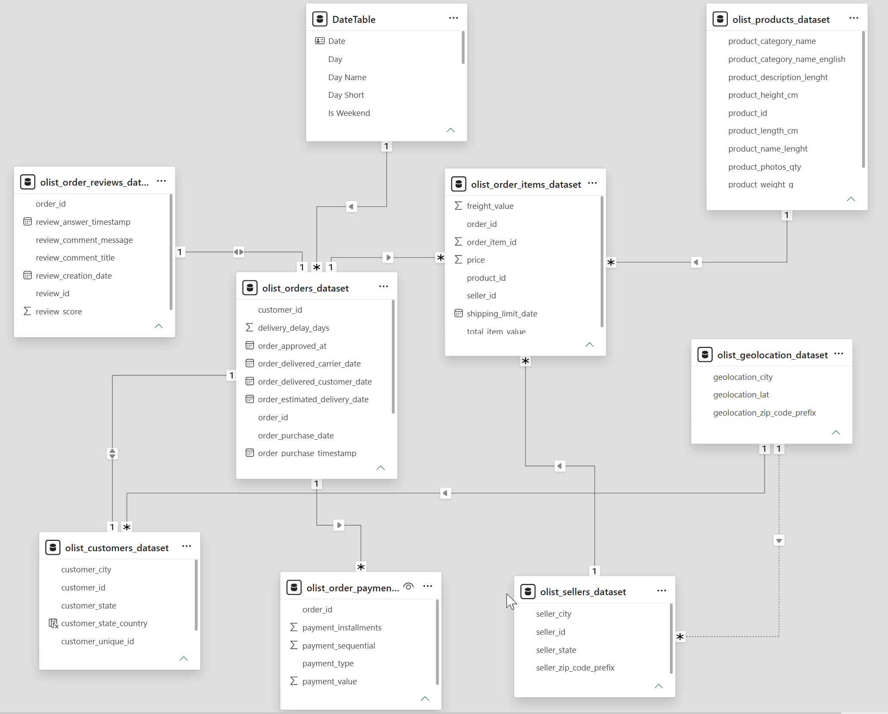
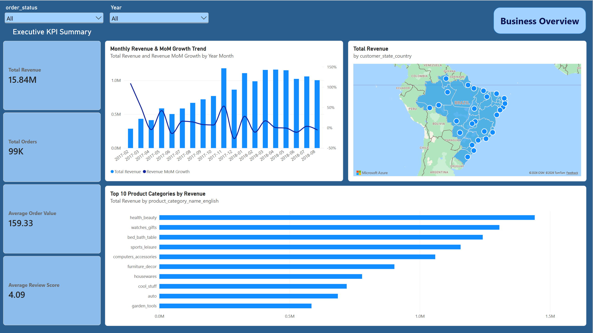
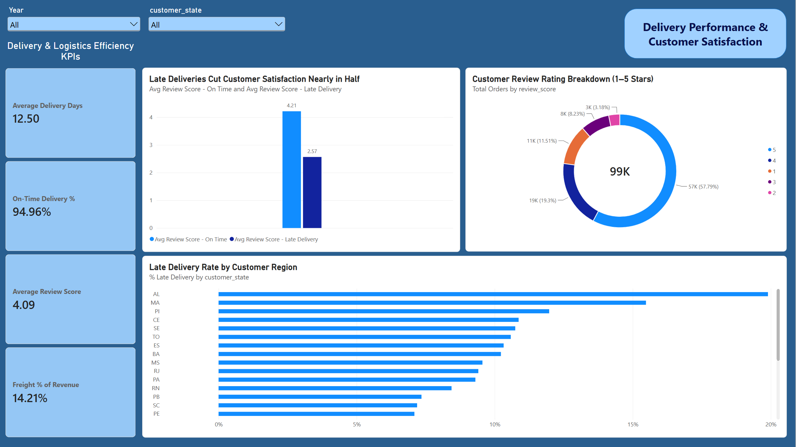
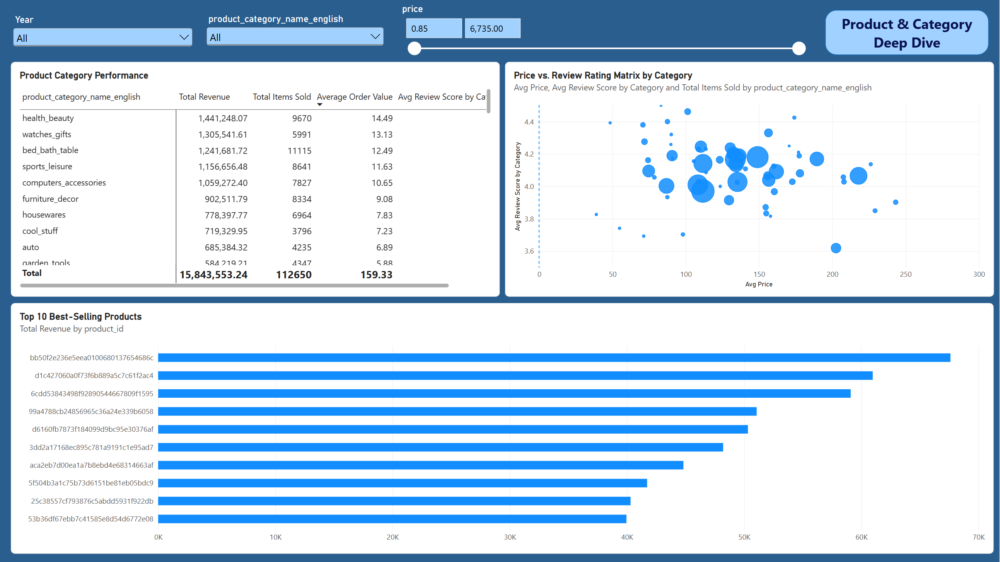
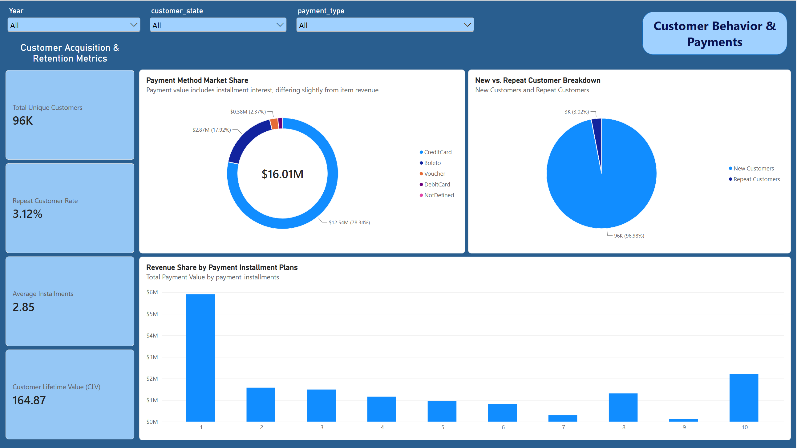

# Brazilian E-Commerce Performance Dashboard

An end-to-end business intelligence project analyzing 100K+ orders from Olist, Brazil's largest department store marketplace, to answer three core business questions: **Which products drive the most revenue? How well is our delivery operation performing? Who are our customers, and are we retaining them?**

** [View Live Interactive Dashboard](https://app.powerbi.com/view?r=eyJrIjoiN2UwOWIyZjMtZWEyNi00NjNlLWJjZjctOWMwM2Q0MTE1NDliIiwidCI6ImFmMWYzNzUzLTM5MjUtNGU2Zi05NDliLTk3YzAwNzMyMDgwMyIsImMiOjEwfQ%3D%3D)**

---

## Table of Contents

- [Overview](#-Overview)
- [Live Dashboard](#-Live-Dashboard)
- [Dataset](#-dataset)
- [Tools & Skills Used](#-tools--skills-used)
- [Data Cleaning & Transformation](#-data-cleaning--transformation)
- [Data Model](#-data-model)
- [Key Metrics (DAX Measures)](#-key-metrics-dax-measures)
- [Dashboard Pages](#-dashboard-pages)
- [Key Insights](#-Key-Insights)
- [Challenges & Solutions](#-challenges--solutions)
- [How to Reproduce](#-how-to-reproduce)

---

## Overview

Olist connects small businesses across Brazil to major marketplaces, handling logistics through its own partner network. This project simulates a real-world analytics engagement: taking nine raw, disconnected CSV exports and turning them into a decision-ready BI product for stakeholders across Sales, Logistics, and Customer Experience teams.

**Business questions this dashboard answers:**
1. How is revenue trending, and which product categories drive it?
2. Is our delivery operation meeting customer expectations, and does it affect satisfaction?
3. Who are our customers, how do they pay, and are we earning repeat business?

---

## 🔗 Live Dashboard

** [CLICK HERE TO EXPLORE THE FULL INTERACTIVE DASHBOARD](https://app.powerbi.com/view?r=eyJrIjoiN2UwOWIyZjMtZWEyNi00NjNlLWJjZjctOWMwM2Q0MTE1NDliIiwidCI6ImFmMWYzNzUzLTM5MjUtNGU2Zi05NDliLTk3YzAwNzMyMDgwMyIsImMiOjEwfQ%3D%3D)**

The published report includes 4 fully interactive pages with cross-filtering slicers (Year, Region, Product Category, Payment Type) synchronized across all pages.

---

## Dataset

**Source:** [Brazilian E-Commerce Public Dataset by Olist — Kaggle](https://www.kaggle.com/datasets/olistbr/brazilian-ecommerce)

| Table | Rows | Description |
|---|---|---|
| `olist_orders_dataset` | 99,441 | Order status and timestamps |
| `olist_order_items_dataset` | 112,650 | Line items, price, freight |
| `olist_order_payments_dataset` | 103,886 | Payment method and installments |
| `olist_order_reviews_dataset` | 99,224 | Customer review scores and comments |
| `olist_customers_dataset` | 99,441 | Customer location data |
| `olist_products_dataset` | 32,951 | Product category and dimensions |
| `olist_sellers_dataset` | 3,095 | Seller location data |
| `olist_geolocation_dataset` | 1,000,163 | Zip code to lat/lng mapping |
| `product_category_name_translation` | 71 | Portuguese → English category names |

**Time period covered:** September 2016 – October 2018

---

## Tools & Skills Used

- **Power Query (M)** — data cleaning, transformation, deduplication
- **Power BI Data Modeling** — star-schema relationships, handling ambiguous filter paths
- **DAX** — 25+ custom measures across Sales, Delivery, Customer, and Payment KPIs
- **Power BI Desktop Service** — interactive report design, synchronized slicers, publishing

---

## Data Cleaning & Transformation

All cleaning was performed in Power Query before modeling. Key steps:

- **Deduplicated geolocation data**: reduced 1,000,163 rows to ~19,000 by grouping on zip code prefix and averaging latitude/longitude, preventing relationship fan-out.
- **Resolved duplicate review records**: 547 orders had 2–3 review entries; sorted by `review_answer_timestamp` descending and removed duplicates to enforce a clean 1:1 order-to-review relationship (98,673 unique order reviews retained).
- **Handled missing product categories**: 610 products (1.9%) had a blank `product_category_name`; replaced with `"outros"` (others) rather than dropped, preserving revenue and item-count integrity.
- **Fixed category translation mismatches**: 3 category names (`outros`, `portateis_cozinha_e_preparadores_de_alimentos`, `pc_gamer`) had no match in the official translation table, causing 623 blank English category labels after the merge — resolved with a conditional mapping column.
- **Standardized data types**: enforced Text type on all zip code and ID columns to preserve leading zeros; converted timestamp columns to proper Date/Time types.
- **Preserved legitimate nulls**: order approval/delivery date nulls (reflecting canceled/undelivered orders) were intentionally kept rather than imputed, to avoid distorting delivery-time calculations.

---

## Data Model

A star-schema-style model was built with the following relationships:

  

---
## Key Metrics (DAX Measures)

25+ custom DAX measures were built, organized into 6 categories: Sales KPIs, Customer KPIs, 
Product Analytics, Review & Logistics KPIs, Payment KPIs, and Time Intelligence.

**[View full list of DAX measures →](docs/DAX_measures.md)**

**Highlight measure** — the one driving the project's core insight:

\`\`\`dax
Avg Review Score - Late Delivery = 
CALCULATE([Average Review Score], olist_orders_dataset[order_delivered_customer_date] > olist_orders_dataset[order_estimated_delivery_date])
\`\`\`

---

## Dashboard Pages

### 1️⃣ Business Overview
Executive summary of revenue trends, top-performing categories, and geographic revenue distribution.

   
  <em>Business Overview</em>

### 2️⃣ Delivery Performance & Customer Satisfaction
Deep dive into delivery timeliness and its direct link to customer review scores.

   
  <em>Delivery Performance & Customer Satisfaction</em>

### 3️⃣ Product & Category Deep Dive
Category-level performance, price-vs-satisfaction analysis, and top-selling products.

   
  <em>Product & Category Deep Dive</em>

### 4️⃣ Customer Behavior & Payments
Customer acquisition/retention metrics, payment method mix, and installment plan analysis.

   
  <em>Customer Behavior & Payments</em>

---

## Key Insights

- **Delivery speed drives satisfaction, not just meets it.** Late deliveries correlate with a review score of **2.57/5**, compared to **4.21/5** for on-time orders — a ~39% drop, despite the company maintaining a strong **94.96% on-time delivery rate**.
- **Retention is the weakest link in an otherwise healthy funnel.** Only **3.12% of customers** placed a second order, despite an average review score of 4.09/5 — suggesting satisfaction alone isn't converting into loyalty, a signal worth investigating with a CRM or loyalty program.
- **Revenue is concentrated but not overly dependent on one category.** The top 10 of 70+ product categories (led by Health & Beauty) account for a meaningful share of the $15.8M total revenue, with no single category creating over-reliance risk.
- **Credit card dominates payment behavior**, representing 78% of total transaction value, with an average of 2.85 installments per order — a hint that flexible payment terms matter to Brazilian consumers.
- **Geographic risk exists in delivery performance.** States farther from the Southeast logistics hub (e.g., AL, MA, PI) show late-delivery rates several times higher than the national average — a candidate for regional carrier renegotiation.

---

## Challenges & Solutions

| Challenge | Solution |
|---|---|
| Geolocation table had 26% duplicate rows, risking relationship fan-out | Grouped and averaged coordinates by zip code prefix before modeling |
| Ambiguous filter path when connecting geolocation to both customers and sellers | Set one relationship inactive; activated selectively via `USERELATIONSHIP()` |
| Revenue-by-time chart showed all data collapsing into a single "(Blank)" bucket | Diagnosed a Date vs. Date/Time type mismatch in the relationship key; created a date-only column to fix the join |
| Category translation table was missing 3 real categories, causing blank labels | Built a conditional DAX column to map the missing categories manually |

---

## How to Reproduce

1. Download the dataset from [Kaggle](https://www.kaggle.com/datasets/olistbr/brazilian-ecommerce)
2. Open `powerbi/olist_dashboard.pbix` in Power BI Desktop
3. Update the data source file paths under **Transform Data → Data Source Settings**
4. Refresh the model

---

**Sẻ Thế Khải**

